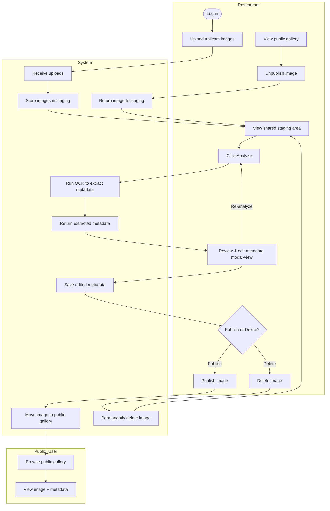
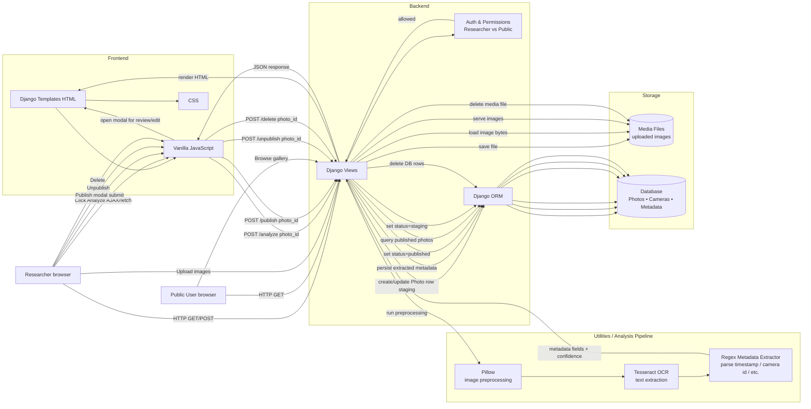
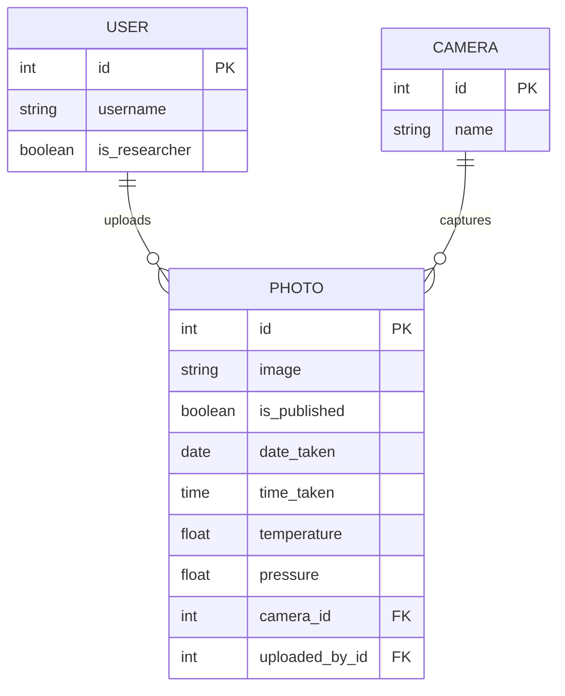

# django-trailcam-animal-tracker


---

# 🦌 Trailcam Wildlife Research Platform

A collaborative Django-based platform for **uploading, analyzing, staging, and publishing trail camera images** for wildlife research.

This project is designed to support **teams of researchers** working together to process large volumes of trailcam images by extracting metadata (via OCR), reviewing results, editing metadata, and publishing only high-quality, validated images to a public gallery.

---

## ✨ Key Features

### 🔐 Role-Based Access

* **Public users**

  * View published wildlife images in the gallery
* **Researchers**

  * Upload trailcam images
  * Analyze images using OCR
  * Edit metadata inline
  * Publish / unpublish images
  * Collaborate in a shared staging area

---

### 🧪 Staging → Publishing Workflow

* All uploaded photos enter a **shared staging area** (`/upload`)
* Any researcher can:

  * Analyze metadata
  * Correct OCR results
  * Delete unnecessary images
* Only **validated images** are published to the public gallery
* Published images can later be **unpublished** and returned to staging

This workflow ensures **data quality, collaboration, and accountability**.

---

### 🧠 OCR-Based Metadata Extraction

When a researcher clicks **Analyze**, the system:

1. Crops the bottom overlay of the trailcam image
2. Applies OCR (Tesseract)
3. Extracts:

   * Camera ID (e.g. `TRAILCAM05`)
   * Date
   * Time
   * Temperature (°C)
   * Pressure (inHg)
4. Saves parsed metadata to the database

Researchers can then **review and edit** extracted values before publishing.

---

### 📝 Inline Metadata Editing (Modal Editor)

* Clicking a photo card opens a **modal editor**
* Metadata fields use appropriate controls:

  * Camera → text input (normalized)
  * Date → date picker
  * Time → time picker
  * Temperature / Pressure → numeric inputs with validation
* A **Save** button appears only when changes are made
* Successful saves close the modal automatically

---

### 🖼️ Gallery Experience

* Clean, card-based UI
* Optional toggle to hide/show metadata
* Hover and modal interactions for better image inspection
* Public gallery shows **only published images**

---

## 🧱 Tech Stack

| Layer            | Technology                     |
| ---------------- | ------------------------------ |
| Backend          | Django                         |
| Frontend         | Django Templates + Vanilla JS  |
| OCR              | Tesseract (via `pytesseract`)  |
| Image Processing | Pillow                         |
| Database         | SQLite (dev), easily swappable |
| Auth             | Django Auth                    |
| Styling          | CSS (externalized, modular)    |

---

## 📂 Project Structure (Relevant Parts)

```text
django-trailcam-animal-tracker/
│
├── wildlife/
│   ├── models.py          # Photo, Camera, Species, etc.
│   ├── views.py           # Upload, analyze, publish, unpublish
│   ├── urls.py
│   ├── templates/
│   │   └── wildlife/
│   │       ├── base.html
│   │       ├── upload.html
│   │       └── gallery.html
│   ├── static/
│   │   └── wildlife/
│   │       └── styles.css
│   └── utils/
│       ├── ocr.py         # OCR + regex parsing logic
│       └── utils.py       # Shared helpers
│
├── media/                 # Uploaded images
└── manage.py
```

---

## 🔁 Core Workflows

### 1️⃣ Upload & Staging

1. Researcher uploads images
2. Images appear in `/upload` (staging)
3. Images are **not public**

---

### 2️⃣ Analysis

1. Researcher clicks **Analyze**
2. OCR extracts metadata
3. Results are stored and displayed
4. Researchers can edit metadata inline

---

### 3️⃣ Publishing

1. Image must have valid metadata
2. Researcher clicks **Publish**
3. Image becomes visible in `/gallery`

---

### 4️⃣ Unpublishing

1. Researcher clicks **Unpublish** in gallery
2. Image returns to staging
3. Can be edited or deleted

---

## 🛡️ Data Integrity & Validation

* Metadata inputs enforce:

  * Valid dates/times
  * Reasonable temperature/pressure ranges
* Server-side validation ensures correctness
* OCR errors are expected and handled gracefully

---

## 🚀 Getting Started

### Install dependencies

```bash
pip install django pillow pytesseract
```

### Install Tesseract (macOS)

```bash
brew install tesseract
```

### Run server

```bash
python manage.py migrate
python manage.py runserver
```

---

## 🧭 Future Enhancements

* Automated animal classification (CV model)
* Batch analysis
* Per-field confidence scores
* Researcher activity logs
* Dataset export tooling
* Deployment (Docker / cloud)

---

## 📜 License

This project is intended for **academic and research use**.
License can be added as needed.

---


## 🔁 User Flow Diagrams



## 🧱 System Architecture Diagram



## 🗃️ Data Model Diagram 

