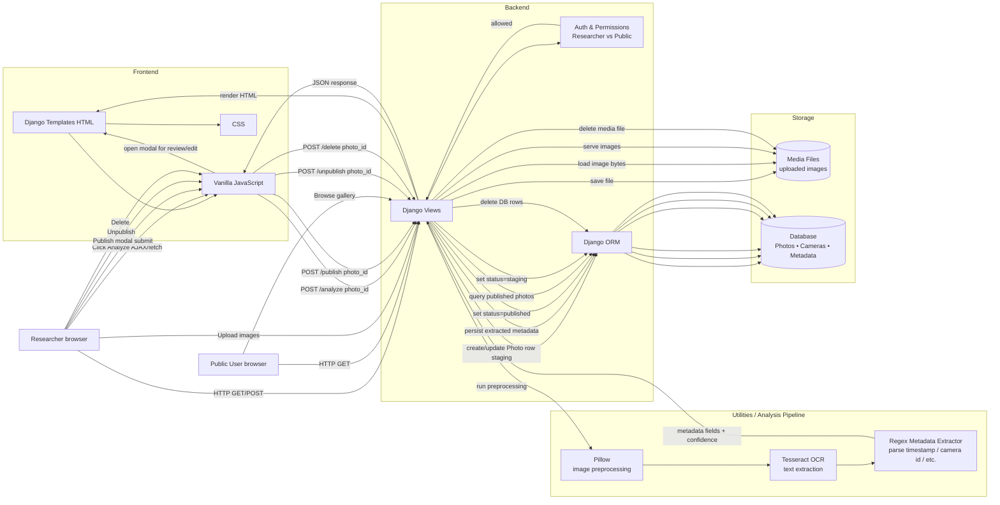
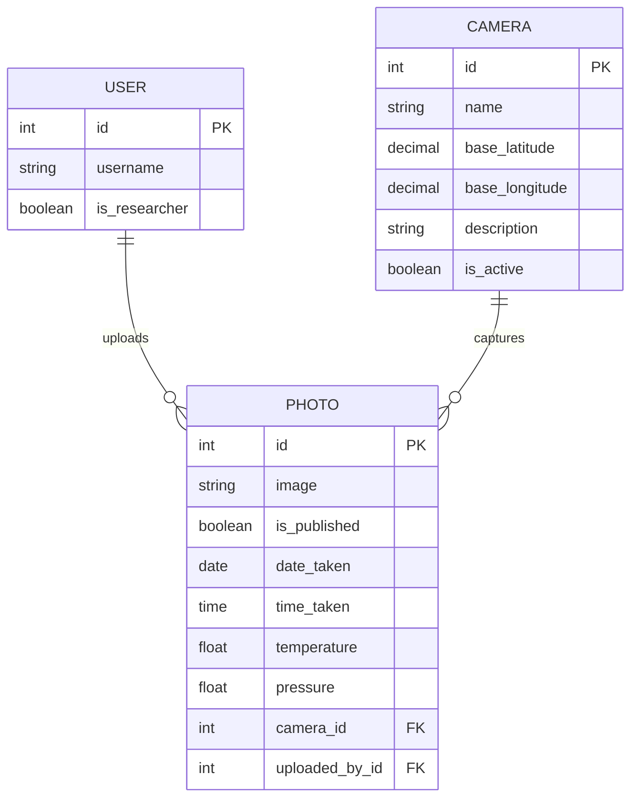

# 🦌 Trailcam Wildlife Research Platform

A collaborative Django-based platform for **uploading, analyzing, staging, and publishing trail camera images** for wildlife research.

This project is designed to support **teams of researchers** working together to process large volumes of trailcam images by extracting metadata (via OCR), reviewing results, editing metadata, and publishing only high-quality, validated images to a public gallery.

---

## ✨ Key Features

### 🔐 Role-Based Access

* **Public users**

  * View published wildlife images in the gallery
* **Researchers**

  * Upload trailcam images
  * Analyze images using OCR + SpeciesNet detections
  * Edit metadata inline
  * Publish / unpublish images
  * Collaborate in a shared staging area
  * Manage cameras and locations
  * Collaborate in a shared staging area

---

### 🧪 Staging → Publishing Workflow

* All uploaded photos enter a **shared staging area** (`/upload`)
* Any researcher can:

  * Analyze metadata
  * Correct OCR results
  * Delete unnecessary images
* Only **validated images** are published to the public gallery
* Published images can later be **unpublished** and returned to staging

This workflow ensures **data quality, collaboration, and accountability**.

---

### 🧠 OCR + AI (SpeciesNet) Analysis

When images are uploaded (or a researcher clicks **Analyze**), the system:

1. Crops the bottom overlay of the trailcam image
2. Applies OCR (Tesseract)
3. Extracts:
   * Camera ID (e.g. `TRAILCAM05`)
   * Date
   * Time
   * Temperature (°C)
   * Pressure (inHg)
4. Normalizes common OCR errors:
   * 0, Q, D -> 0 in a camera number
5. Automatically attaches/creates Camera (defaults to St. Edward's Univ. coords on create)
6. Runs **SpeciesNet** on the image to detect animals/people/vehicles and stores detections with normalized bounding boxes (0..1)
7. Saves parsed metadata and detections to the database

Privacy: when a photo is published, any detection classified as a person is permanently blacked out in the saved image.

Researchers can then **review and edit** extracted values before publishing.

---

### 📷 Camera Management (CRUD)

Researchers can manage cameras via the Cameras page.

**Camera Model**

Each camera includes:
    * name (unique, e.g. TRAILCAM05)
    * base_latitude
    * base_longitude
    * description (optional)
    * is_active

**Camera Actions**
  * Create cameras via a page-based form
  * Edit camera metadata via a page-based form
    * Activate / deactivate cameras
    * Search cameras by name or description

**OCR Integration**
    * OCR-extracted camera IDs are normalized (e.g. TRAILCAMQ5 → TRAILCAM05)
    * If a matching active camera exists, it is automatically linked
    * If not, a camera is created automatically using normalized name and default coordinates
    * This ensures consistent camera IDs and location metadata across the dataset.

---

### 📝 Page-based Metadata Editing

* Clicking Edit opens a **page-based editor**
* Metadata fields use appropriate controls:

  * Camera → text input with suggestions
  * Date → date picker
  * Time → time picker
  * Temperature / Pressure → numeric inputs with validation
* A **Save** button persists edits and reloads the editor
* A **Publish** button saves the current edits and publishes in one step (also applies person blackout)

---

### 🖼️ Gallery Experience

* Clean, card-based UI
* Optional toggle to hide/show metadata
* Bounding boxes are rendered on images; people are blacked out
* Filter bar with Camera, Date range, Temperature range, Pressure range, and Species (checkboxes)
* Public gallery shows **only published images**

---

## 🧱 Tech Stack

| Layer            | Technology                     |
| ---------------- | ------------------------------ |
| Backend          | Django                         |
| Frontend         | Django Templates + Vanilla JS  |
| OCR              | Tesseract (via `pytesseract`)  |
| AI Detection     | SpeciesNet (local JSON model)  |
| Image Processing | Pillow                         |
| Database         | SQLite (dev), easily swappable |
| Auth             | Django Auth                    |
| Styling          | CSS (externalized, modular)    |

---

## 📂 Project Structure (Relevant Parts)

```text
django-trailcam-animal-tracker/
│
├── wildlife/
│   ├── models.py          # Photo, Camera, Species, etc.
│   ├── views.py           # Upload, analyze, publish, unpublish
│   ├── urls.py
│   ├── templates/
│   │   └── wildlife/
│   │       ├── base.html
│   │       ├── upload.html
│   │       └── gallery.html
│   ├── static/
│   │   └── wildlife/
│   │       └── styles.css
│   └── utils/
│       ├── ocr.py         # OCR + regex parsing logic
│       └── utils.py       # Shared helpers
│   └── services/
│       └── speciesnet.py  # SpeciesNet detection pipeline + persistence
│
├── media/                 # Uploaded images
└── manage.py
```

---

## 🔁 Core Workflows

### 1️⃣ Upload & Staging

1. Researcher uploads images (single files or entire folders)
2. Client shows a **progress bar** updating as each image is processed server-side
3. Server runs OCR + SpeciesNet during upload
4. Images appear in `/upload` (staging) and are **not public**

---

### 2️⃣ Analysis

1. Researcher can click **Analyze** to re-run OCR + SpeciesNet on a single staging photo
2. OCR extracts metadata; SpeciesNet produces detections and bounding boxes
3. Results are stored and displayed
4. Researchers can edit metadata in the page-based editor

---

### 3️⃣ Publishing

1. Image must have valid metadata
2. Researcher clicks **Publish** (saves current edits automatically)
3. Any person detections are permanently blacked out in the image file
4. Image becomes visible in `/gallery`

---

### 4️⃣ Unpublishing

1. Researcher clicks **Unpublish** in gallery
2. Image returns to staging
3. Can be edited or deleted

---

## 🛡️ Data Integrity & Validation

* Metadata inputs enforce:

  * Valid dates/times
  * Reasonable temperature/pressure ranges
* Server-side validation ensures correctness
* OCR errors are expected and handled gracefully

---

## 🚀 Getting Started

### Install dependencies

Use a virtual environment and install from `requirements.txt`:

```bash
python -m venv .venv
source .venv/bin/activate  # macOS/Linux
# .venv\Scripts\activate  # Windows PowerShell

pip install -r requirements.txt
```

### Install Tesseract (macOS)

```bash
brew install tesseract
```

### Run server

```bash
python manage.py migrate
python manage.py runserver
```

Optional: ensure `speciesnet.json` exists at the project root (or configured path) if required by `services/speciesnet.py`.

---

## 📜 License

This project is intended for **academic and research use**.
License can be added as needed.

---


## 🔁 User Flow Diagrams


## 🧱 System Architecture Diagram



## 🗃️ Data Model Diagram 



---

## 🧭 Roadmap (High-Level)

    ✅ Shared staging workflow
    ✅ Modal-based metadata editing
    ✅ Camera CRUD + OCR integration
    ✅ Animal detection & classification
    ✅ Map-based sightings view
    📊 Excel information Extraction
    🚀 Deployment & background processing


## 🏙️ Images


Public gallery view, where you can filter images, and view locaiton of images on map.


Detailed researcher view of images.
